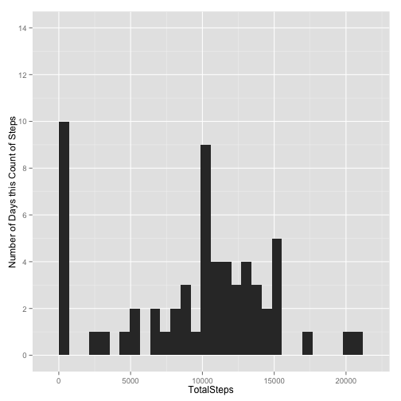
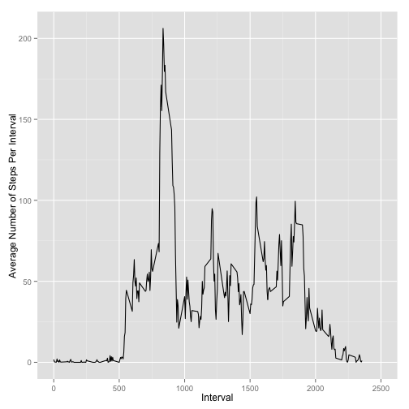
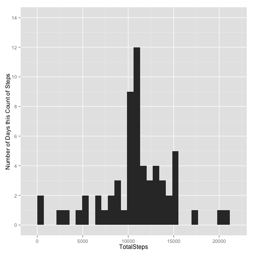
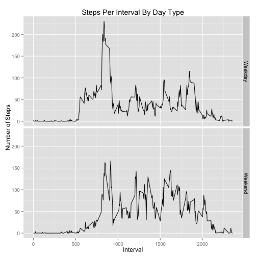

#### Set up environment

```r
setwd("/Users/carl/Projects/Coursera/coursera/Reproducible/RepData_PeerAssessment1")
library(ggplot2)
bw <- 706.4667  # use for binwidth in histograms - Two graphs must match 
```

## Loading and preprocessing the data

```r
activity <- read.csv("activity.csv")
activity$date <- as.Date.character(activity$date)
```

## What is mean total number of steps taken per day?  
#### Create a dataset with the total number of steps per day

```r
# calculate the total number of steps per day
sumStepsPerDay <- aggregate(activity$steps, by=list(activity$date),  FUN=sum, na.rm=TRUE)
names(sumStepsPerDay) <- c("Day", "TotalSteps")
```
#### Histogram - Total number of steps taken per day

```r
# make the histogram tall (limit 14) so it matches the second histogram
gt <- ggplot(data = sumStepsPerDay, aes(x=TotalSteps))
gt+geom_histogram(stat = "bin", binwidth = bw)+
  labs(y="Number of Days this Count of Steps")+   
  scale_y_continuous(limits=c(0, 14), breaks=c(0,2,4,6,8,10,12,14))
```

 

#### Get Mean and Median of data

```r
meanStepsPerDay <- mean(sumStepsPerDay$TotalSteps, na.omit=TRUE)
medStepsPerDay <- median(sumStepsPerDay$TotalSteps)
```
Mean steps per day is: *9354.2295082*  
Median steps per day is: *10395*

## What is the average daily activity pattern?  
#### Create data set with mean Steps by Interval  

```r
# get average number of steps per Interval accross all Days
avStepsPerInterval <- aggregate(activity$steps, by=list(activity$interval),  FUN=mean, na.rm=TRUE)
names(avStepsPerInterval) <- c("Interval", "AverageStepsPerInterval")
```
#### Time Series Plot of Steps per Interval

```r
ga <- ggplot(data = avStepsPerInterval, aes(x=Interval))
ga +  geom_line(aes(y=AverageStepsPerInterval)) +
  scale_x_continuous(limits=c(0, 2500))+
  labs(y="Average Number of Steps Per Interval")
```

 

#### Get the Interval that has the greatest average of steps accross all Days  

```r
# Get the Interval that has the greatest average of steps accross all Days 
IntervalMaxSteps <- avStepsPerInterval[avStepsPerInterval$AverageStepsPerInterval == max(avStepsPerInterval$AverageStepsPerInterval), ]$Interval
```

#### The Interval with the greatest average of steps accross all days is Interval number: *835*  

## Inputing missing values  
#### Get number of NA cells

```r
# get number of NA cells in Steps
num_na <- sum(is.na(activity$steps))
```

#### There are: *2304* cells with missing values

#### Fill in missing values  
#### My scheme for filling in the missing values is to replace the missing value with the mean number of steps for the Interval accross all days.  

```r
# replace all Interval NA cells of activity dataset with mean of this Interval from all other days
activityFilled <- activity
for(i in 1:nrow(activityFilled)){
  if(is.na(activityFilled[i, 'steps'])){
    thisInterval <- activityFilled[i, 'interval']
    thisMean <- avStepsPerInterval[avStepsPerInterval$Interval == thisInterval, 'AverageStepsPerInterval']
    activityFilled[i, 'steps'] <- thisMean
  }
}
```
#### Same histogram as above using filled in data

```r
avStepsPerIntervalFilled <- aggregate(activityFilled$steps, by=list(activityFilled$interval),  FUN=mean, na.rm=TRUE)
names(avStepsPerIntervalFilled) <- c("Interval", "AverageStepsPerInterval")

sumStepsPerDayFilled <-aggregate(activityFilled$steps, by=list(activityFilled$date),  FUN=sum, na.rm=TRUE)
names(sumStepsPerDayFilled) <- c("Day", "TotalSteps")

gtf <- ggplot(data = sumStepsPerDayFilled, aes(x=TotalSteps))

gtf+geom_histogram(stat = "bin", binwidth = bw)+
  labs(y="Number of Days this Count of Steps")+
  scale_y_continuous(limits=c(0, 14), breaks=c(0,2,4,6,8,10,12,14))
```

 

#### Get Mean and median of filled in data

```r
meanStepsPerDayFilled <- format(mean(sumStepsPerDayFilled$TotalSteps), scientific=FALSE)
medStepsPerDayFilled <- format(median(sumStepsPerDayFilled$TotalSteps), scientific=FALSE)
```

#### Mean steps per day filled data is: *10766.19*  
#### Median steps per day filled data is: *10766.19*

#### The values of mean and median differ from the unfilled dataset in that here they are slightly larger. This is due to including numeric values where previous values were treated as zero.  

## Are there differences in activity patterns between weekdays and weekends?  
#### Create new data set with column for Weekday or Weekend

```r
activityFilled$weekend <- weekdays(activityFilled$date)
activityFilled$weekend <- plyr::revalue(activityFilled$weekend, c("Monday"="Weekday", "Tuesday"="Weekday","Wednesday"="Weekday","Thursday"="Weekday", "Friday"="Weekday","Saturday"="Weekend","Sunday"="Weekend"))
activityFilled$weekend <- as.factor(activityFilled$weekend)

meanStepsPerIntervalFilledByWeekend <-aggregate(activityFilled$steps, by=list(activityFilled$interval, activityFilled$weekend),  FUN=mean, na.rm=TRUE)
names(meanStepsPerIntervalFilledByWeekend) <- c("Interval", "Weekend",  "MeanSteps")
```
#### Make Time Value Plot for each of Weekdays and Weekends  

```r
gmi <- ggplot(data = meanStepsPerIntervalFilledByWeekend, aes(x=Interval))
gmi+geom_line(aes(y = MeanSteps))+facet_grid(Weekend~.)+labs(y="Number of Steps")+ggtitle("Steps Per Interval By Day Type")
```

 
